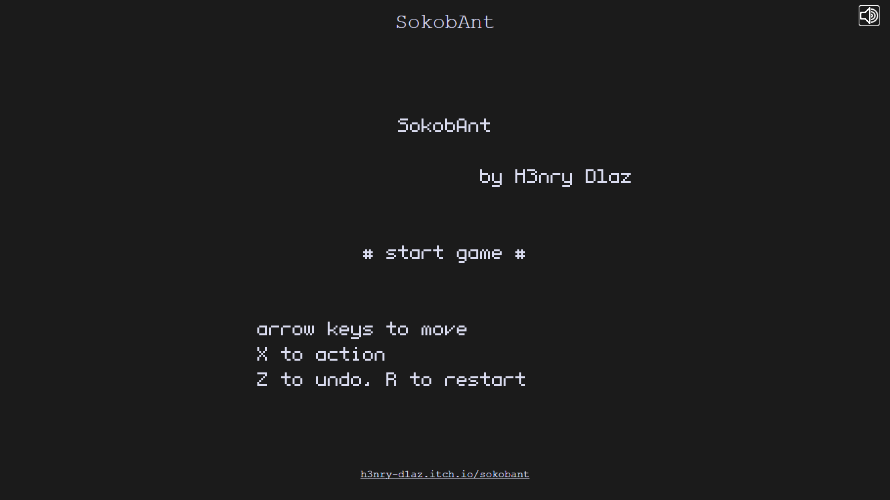
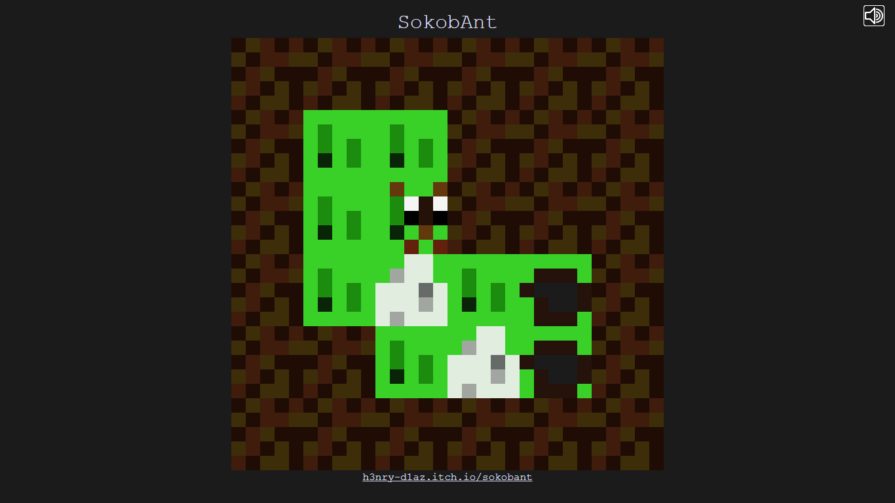
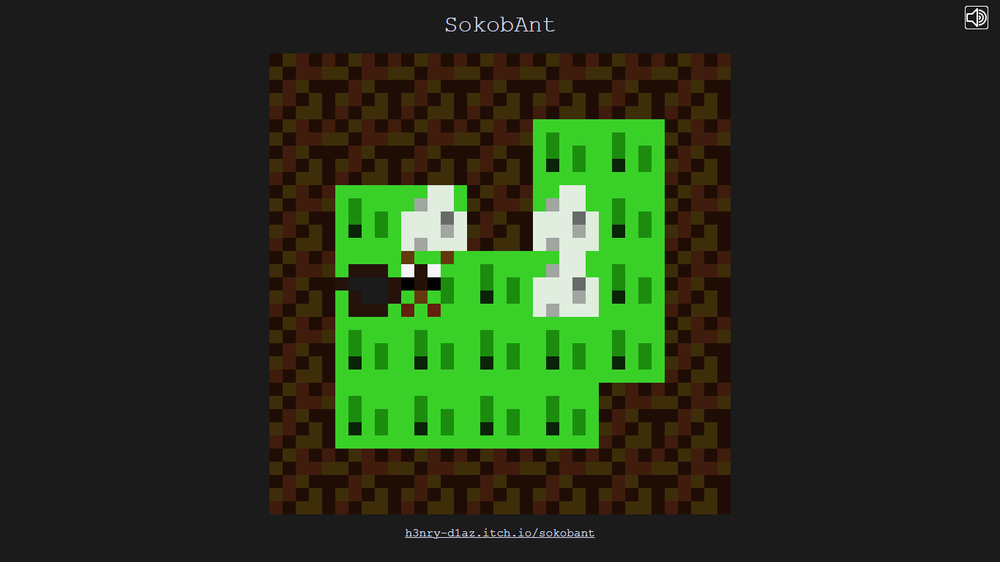
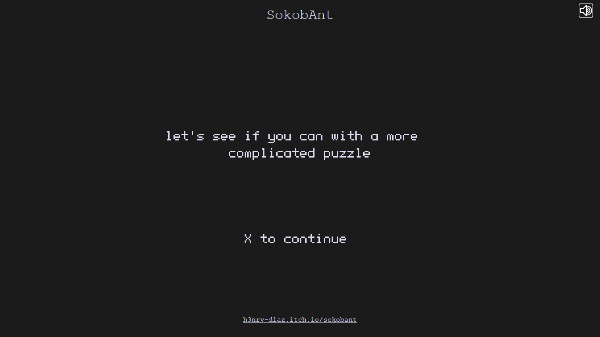
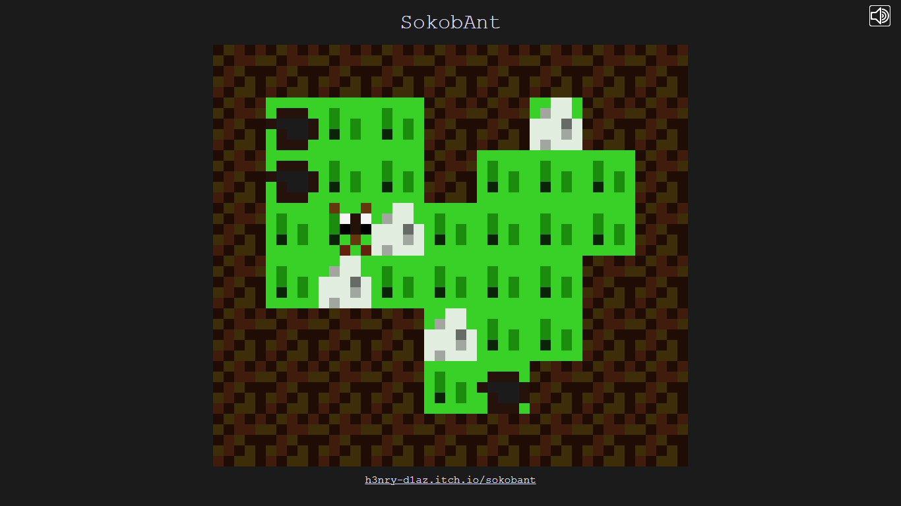
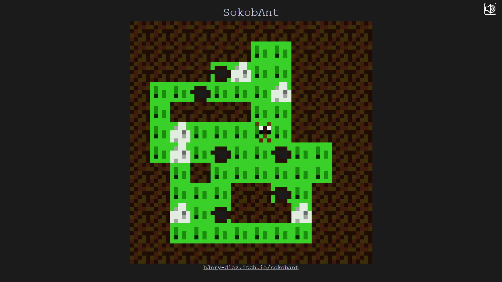

<h1 align="center">SokobAnt</i></h1>

A puzzle game based on the classic Sokoban

**SokobAnt** is a small **puzzle game** inspired by the classic Japanese game **Sokoban** *(actually, it's just a compilation of levels for it)*, which is about an ant that has to **drag small mountains of sugar to its anthill** and that was made to test the capabilities of the [PuzzleScript](https://www.puzzlescript.net/) language/game engine.

The game consists of **5 levels** progressively ordered according to their **difficulty**, the first being in a **6x6 block grid** and the last one ending in a **20x20 grid**.

Also, this game is *(like most of my titles)* published on the [itch.io](https://itch.io/) platform, so you can find *this same information* as well as *download the compiled HTML file* more easily on [that page](https://h3nry-d1az.itch.io/sokobant).

#### Some screenshots

<em>Title screen</em>

 

<em>Level 1 of 5</em>

 

 

<em>Level 2 of 5</em>

 

<em>Beginning of level 3 of 5</em>

 

<em>Level 3 of 5</em>

 

<em>Level 4 of 5</em>

I hope you enjoy it and if so, please **leave a positive review, give the project a star and share it**, it would help me a lot.
